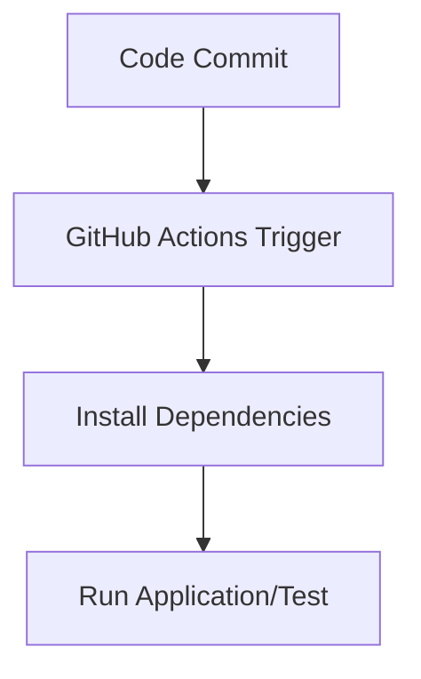

Here is your **updated README.md** with the **Deployment Options** section aligned to what you've actually implemented in your repository — i.e., **CI pipeline only (no deployment)**.

---

````markdown
# 🚀 Flask CI/CD Demo with GitHub Actions

A simple Flask web application integrated with a CI/CD pipeline using **GitHub Actions**. This project demonstrates how to automate testing of a Python Flask app using GitHub Actions.

---

## 📁 Project Structure

```bash
flask-ci-cd-demo/
│
├── app.py               # Main Flask application
├── requirements.txt     # Python dependencies
├── .github/
│   └── workflows/
│       └── ci-cd.yml    # GitHub Actions workflow for CI/CD
└── README.md            # Project documentation
````

---

## ⚙️ Tech Stack

* **Python 3**
* **Flask**
* **GitHub Actions**

---

## 🛠️ Features

✅ Simple Flask Web App
✅ GitHub Actions CI Pipeline
✅ Automatic Installation & Test Execution
🚫 No Deployment Configured (can be extended)

---

## 🔁 CI/CD Pipeline Flow



---

## 📦 Setup Instructions

### 1. Clone the Repository

```bash
git clone https://github.com/Sadanki/flask-ci-cd-demo.git
cd flask-ci-cd-demo
```

### 2. Create Virtual Environment

```bash
python3 -m venv venv
source venv/bin/activate   # On Windows: venv\Scripts\activate
```

### 3. Install Requirements

```bash
pip install -r requirements.txt
```

### 4. Run Flask App Locally

```bash
python app.py
```

Visit `http://127.0.0.1:5000/` in your browser.

---

## ⚙️ GitHub Actions Workflow

The workflow file `.github/workflows/ci-cd.yml` performs the following:

* ✅ Trigger on push to `main` or pull requests
* ⚙️ Set up Python environment
* 📦 Install dependencies
* 🧪 Run application (test placeholder)

You can enhance this by adding actual unit tests or deployment steps.

---

## 🧪 Sample Test Integration (Optional)

You can add a `test_app.py` like below to include basic test cases:

```python
def test_home():
    from app import app
    client = app.test_client()
    response = client.get('/')
    assert response.status_code == 200
    assert b"Hello, World!" in response.data
```

Then install `pytest` and update your workflow:

```bash
pip install pytest
pytest
```

---

## 🚀 Deployment Options

This project **currently does not include deployment**. The GitHub Actions pipeline focuses only on:

* 🔄 Code Pull/Push Events
* 📦 Dependency Installation
* 🧪 Application Run / Test Stub

You can extend it for deployment to platforms like:

* Heroku
* AWS EC2
* DockerHub
* Azure App Services

Need help adding one? Let me know and I can generate a ready-to-use template for your target.

---

---

## 🙌 Acknowledgments

* [Flask Documentation](https://flask.palletsprojects.com/)
* [GitHub Actions Docs](https://docs.github.com/en/actions)

---

## 📬 Contact

**Author:** Sadanki
📧 Email: [your.email@example.com](mailto:your.email@example.com)
🔗 GitHub: [Sadanki](https://github.com/Sadanki)

---

